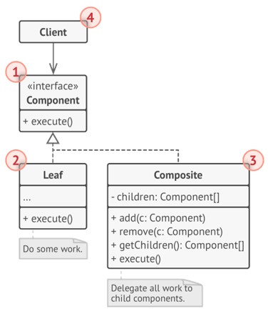

<h1 align="center">Design Pattern</h1>

|     Group      | Design Pattern                                                                                                                        |
| :------------: | :------------------------------------------------------------------------------------------------------------------------------------ |
| **Creational** | Singleton, Factory, Abstract Factory, Prototype, Builder, Dependency Injection, MVC                                                   |
| **Structural** | Adapter, Facade, Composite, Decorator, Bridge, Flyweight, Proxy, DAO                                                                  |
| **Behavioral** | Template, Observer, Mediator, State, Strategy, Chain of Responsibility, Visitor, Memento, Iterator, Interpreter, Command, Null Object |

<h2>Creational</h2>

<details>
<summary>
Singleton
</summary>

<i><b>Singleton</b> ensure that a class has only one instance, while providing a global access point to this instance.</i>


</details>

<details>
<summary>
Factory
</summary>

<i><b>Factory</b> provides an interface for creating objects in a superclass, but allows subclasses to alter the type of objects that will be created.</i>


</details>

<details>
<summary>
Abstract Factory
</summary>

<i><b>Abstract Factory</b> creates entire product families without specifying their concrete classes.</i>


</details>

<details>
<summary>
Prototype
</summary>

<i><b>Prototype</b> allows cloning objects, even complex ones, without coupling to their specific classes.</i>


</details>

<details>
<summary>
Builder
</summary>

<i><b>Builder</b> allows constructing complex objects step by step.</i>


</details>

<details>
<summary>Dependency Injection</summary>

1. Create Maven Project.

2. Config Spring Core to file `pom.xml`.

```xml
<dependency>
    <groupId>org.springframework</groupId>
    <artifactId>spring-context</artifactId>
    <version>6.1.4</version>
</dependency>
```

3. From directory `src/main/resources`, create file `application_context.xml`, and config Spring Beans.

```xml
<?xml version="1.0" encoding="UTF-8"?>
<beans xmlns="http://www.springframework.org/schema/beans"
	xmlns:xsi="http://www.w3.org/2001/XMLSchema-instance"
	xsi:schemaLocation="http://www.springframework.org/schema/beans
		https://www.springframework.org/schema/beans/spring-beans.xsd">

	<bean id="..." class="...">
		<!-- collaborators and configuration for this bean go here -->
	</bean>

	<bean id="..." class="...">
		<!-- collaborators and configuration for this bean go here -->
	</bean>

	<!-- more bean definitions go here -->

</beans>
```

4. Init Application Context in use:

```
ApplicationContext context = new ClassPathXmlApplicationContext("application_context.xml");
```

</details>

<h2>Structural</h2>

<details>
<summary>
Adapter
</summary>

<i><b>Adapter</b> allows objects with incompatible interfaces to collaborate.</i>

**Object Adapter:**


**Class Adapter:**


</details>

<details>
<summary>
Facade
</summary>

<i><b>Facade</b> provides a simplified interface to a library, a framework, or any other complex set of classes.</i>


</details>

<details>
<summary>
Composite
</summary>

<i><b>Composite</b> allows composing objects into a tree-like structure and work with the it as if it was a singular object.</i>



</details>

<details>
<summary>
Decorator
</summary>

<i><b>Decorator</b> allows adding new behaviors to objects dynamically by placing them inside special wrapper objects, called decorators.</i>


</details>

<details>
<summary>
Bridge
</summary>

<i><b>Bridge</b> divides business logic or huge class into separate class hierarchies that can be developed independently.</i>


</details>

<details>
<summary>
Flyweight
</summary>

<i><b>Flyweight</b> allows to fit more objects into the available amount of RAM by sharing common parts of state between multiple objects instead of keeping all of the data in each object.</i>


</details>

<details>
<summary>
Proxy
</summary>

<i><b>Proxy</b> provides an object that acts as a substitute for a real service object used by a client. A proxy receives client requests, does some work (access control, caching, etc.) and then passes the request to a service object.</i>


</details>

<h2>Behavioral</h2>
<details>
<summary>
Template
</summary>

<i><b>Template</b> defines the skeleton of an algorithm in the superclass but lets subclasses override specific steps of the algorithm without changing its structure.</i>


</details>

<details>
<summary>
Observer
</summary>

<i><b>Observer</b> defines a subscription mechanism to notify multiple objects about any events that happen to the object they’re observing.</i>


</details>

<details>
<summary>
Mediator
</summary>

<i><b>Mediator</b> reduces coupling between components of a program by making them communicate indirectly, through a special mediator object.</i>


</details>

<details>
<summary>
State
</summary>

<i><b>State</b> lets an object alter its behavior when its internal state changes. It appears as if the object changed its class.</i>


</details>

<details>
<summary>
Strategy
</summary>

<i><b>Strategy</b> defines a family of algorithms, put each of them into a separate class, and make their objects interchangeable.</i>


</details>

<details>
<summary>
Chain of Responsibility
</summary>

<i><b>Chain of Responsibility</b> passes requests along a chain of handlers. Upon receiving a request, each handler decides either to process the request or to pass it to the next handler in the chain.</i>


</details>

<details>
<summary>
Visitor
</summary>

<i><b>Visitor</b> separates algorithms from the objects on which they operate.</i>


</details>

<details>
<summary>
Memento
</summary>

<i><b>Memento</b> saves and restores the previous state of an object without revealing the details of its implementation.</i>


</details>

<details>
<summary>
Iterator
</summary>

<i><b>Iterator</b> allows sequential traversal through a complex data structure without exposing its internal details.</i>


</details>

<details>
<summary>
Command
</summary>

<i><b>Command</b> turns a request into a stand-alone object that contains all information about the request. This transformation lets you pass requests as a method arguments, delay or queue a request’s execution, and support undoable operations.</i>


</details>
